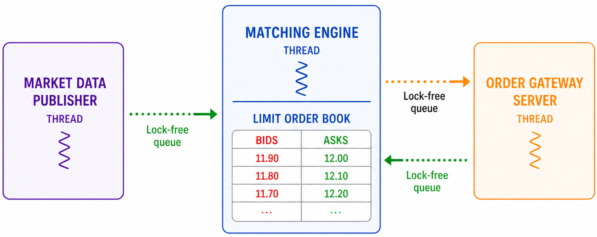
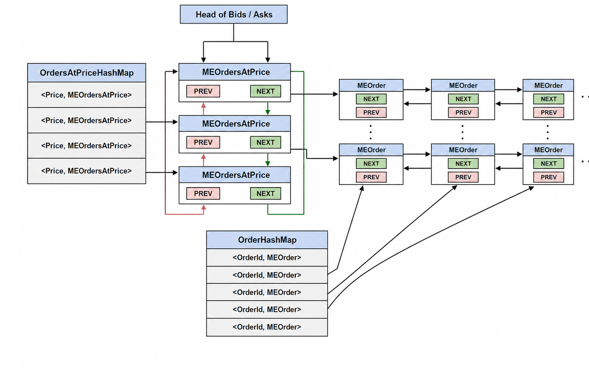
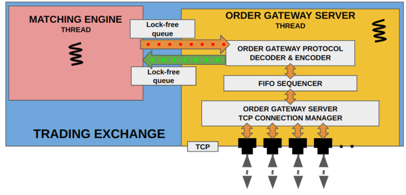
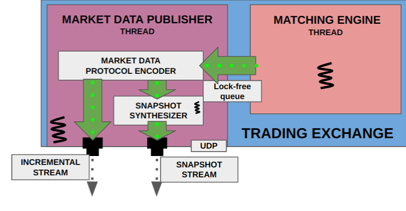

# TradingSystem

The goal of this project is to learn low-level techniques by designing and implementing a Trading System, both exchange-side and client-side in C++.

All the low-level techinques and optimizations will be used in order to achieve maximum performance and lowest latancy as possible.

Suggestions on further optimization are more than welcomed, everything writted in this project is hand-written, **no AI involved**.  

## Exchange

Formed by three main components:
- Market Data Publisher, component that send order book updates to all market participanst.
- Order Gateway server, send order updates to the client involved in those updates.
- Matching Engine, encapsulate the logic and the data related to the order book, receive the orders from the order gateway and modify its state accordingly. 
---

### Matching Engine
Is the main component that keep the state of the order book, it keeps for every asset a list of bids and asks prices, that are the passive order submitted  by the clients, when there is an aggressive order (in both buy or sell) that matches the current available orders it perform the matching and modify the state accordingly.

The main complexity is how the handle the data, for the order book we need:
- Asks/bids order prices ordered from lowest-to-highest/highest-to-lowest because of teh nature of an market.
- Fast random access of orders because of possibles order cancellation or modification.
- Ordering of passive orders of the same price based on priority (newest orders have less priority than oldest one).

In order to achieve this goal we divide the orders in levels based on their prices, every level keep an double-linked list with all the orders ordered by their priority.
Also the price levels, called MEOrdersAtPrice, are connected through a double-linked list for allow easy navigation and random insertion in constant time, those structures are both for asks and bids.

For allow random lookup in constant time we take also the references of the orders and the OrdersAtPrice in two different HashMaps. 

 
 ---

### Order Gateway server
Its purpose is the connect with the market participant through TCP (because we don't want to lose data about orders), collect all the order/operation on the exchange and sent to the matching engine.

Through a Fifo Sequencer the operations are ordered based on their arrival time, then there is a layer for decoding and encoding the data (note that the format of the internal data and the one received from the client are different).

The informations are sent and received to/from the matching engine through a lock-free queue, thanks to it we can share data between two threads without needing synchronization (the queues are single producer single consumer SPSC).

 ---

### Market Data Publishers

This component goal is send market updates to all the entities registred to our upstreamm.

It does so by having a multicast socket constantly streaming the state changes on the matching engine. The data are received through a lock-free queue shared with the matching engine, are then encoded in the public format for the market updates and the multicasted.

The socket connection chosen is the UDP for performance reasons, in order to handle possible packet lose there is anothe sub-component, the **Snapshot Synthetizer**, which goal is to create a partial state of the order book, so in case of packets losts we can just take the full state of the order book and start getting incrementals updates from there.

 ---

## Market Participant

TODO

