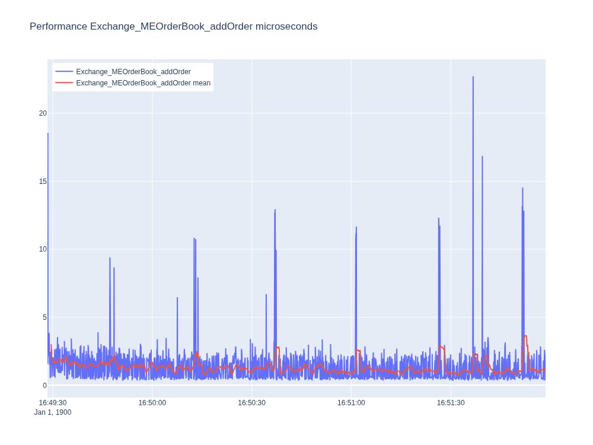
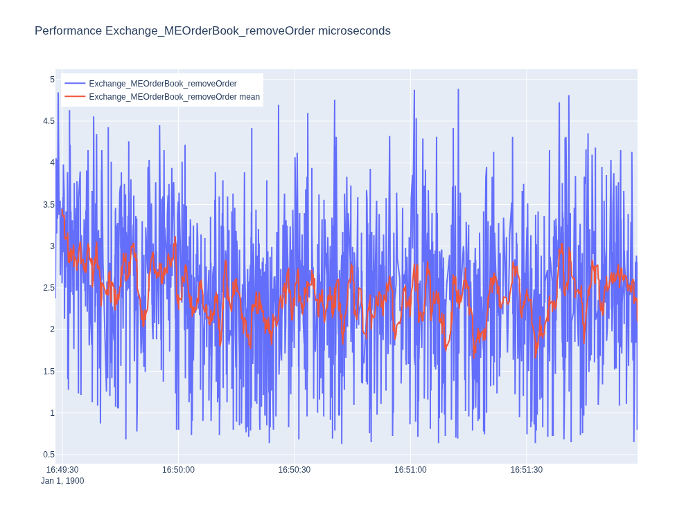
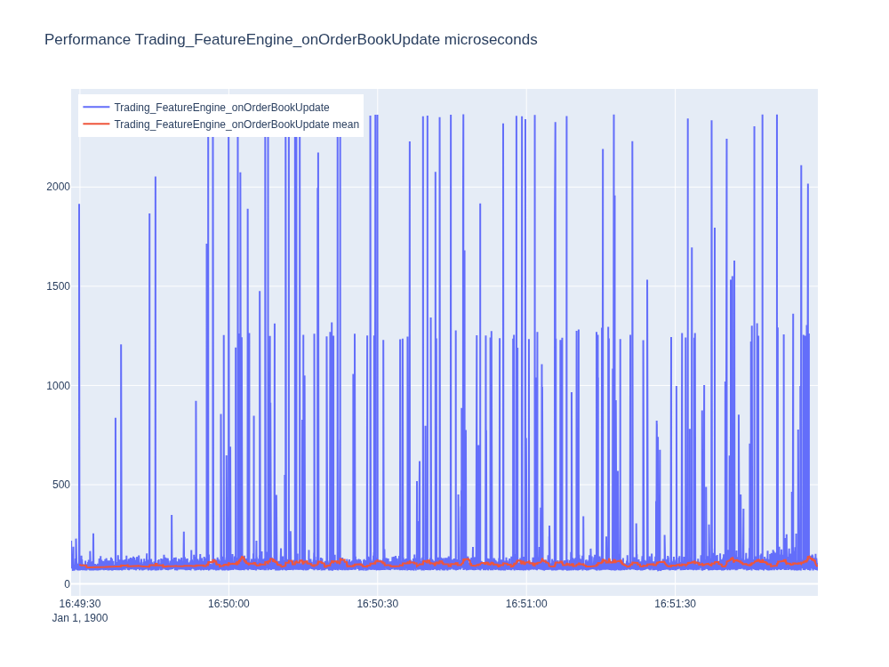
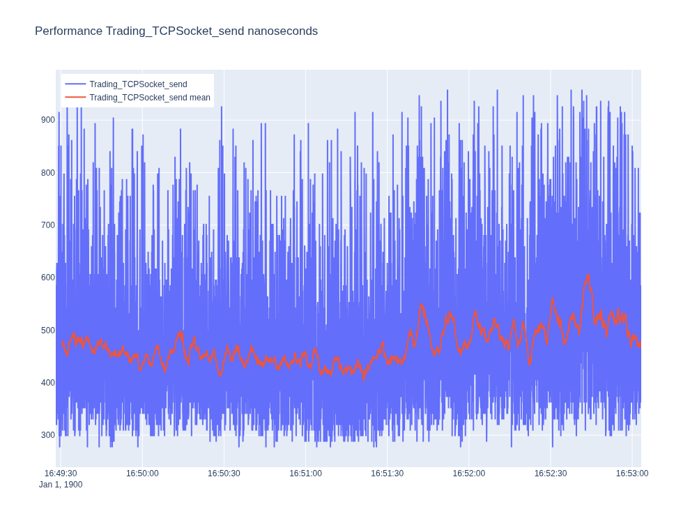
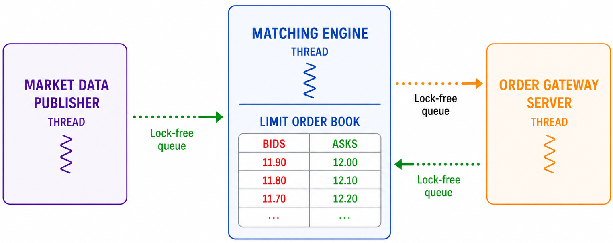
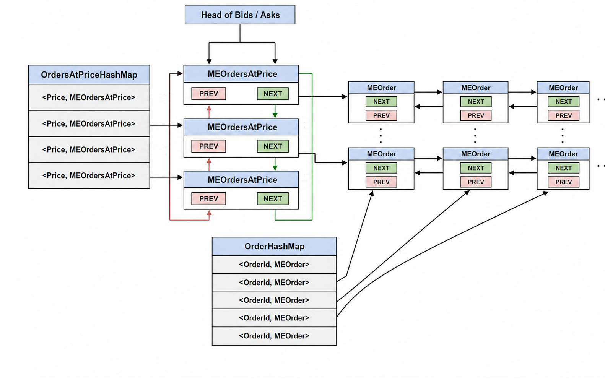
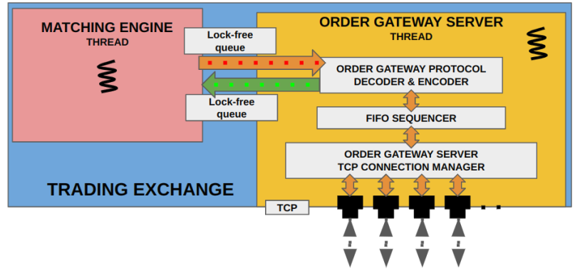
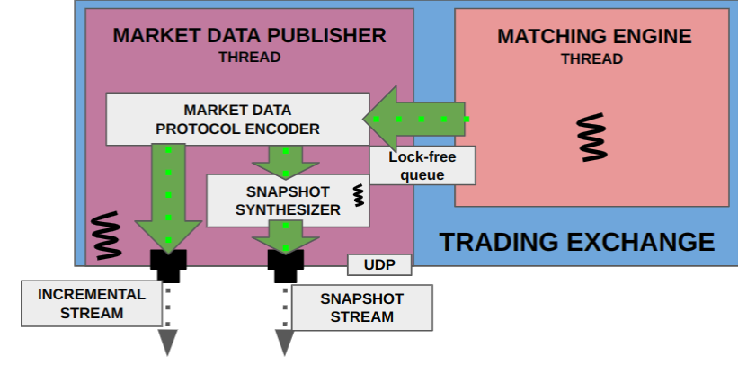
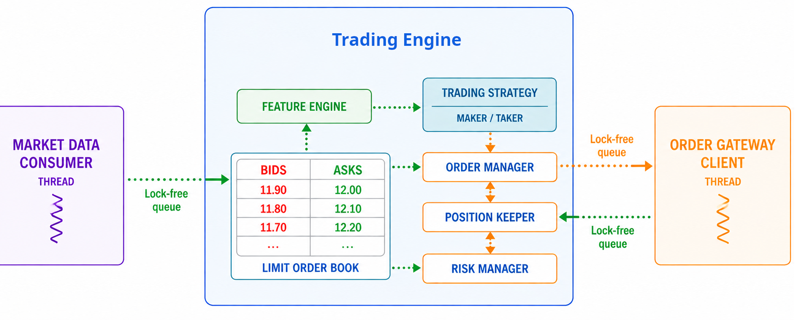

# TradingSystem

A low-latency trading system and exchange simulator written in C++20. It models both sides of a trading ecosystem: an exchange with a matching engine, order gateway, and market-data publisher, and clients running automated trading strategies. 

The project explores HFT-oriented techniques including custom order-book data structures, memory pools, lock-free queues, TCP order entry, UDP multicast market data, and performance profiling.


## Prerequisites

- Linux environment
- C++20-compatible compiler, such as `g++`
- CMake 3.25 or newer
- Loopback network interface (`lo`), used by the exchange and clients for local communication

## Build

From the project root, run:

```bash
./build.sh
```

This configures the project in `build/` and compiles the exchange, client, and test executables.

## Running the System

Start the exchange first:

```bash
./build/exchange_main
```

In a second terminal, start the example clients:

```bash
./run_clients.sh
```

The exchange listens for client orders on the local TCP gateway, while market data is distributed over local multicast sockets. Stop the exchange with `Ctrl+C`.

## Client Command-Line Arguments

Clients can be started directly with the following format:

```text
./build/client_main CLIENT_ID ALGO_TYPE [CLIP THRESHOLD MAX_ORDER_SIZE MAX_POSITION MAX_LOSS]...
```

Available algorithm types are `MAKER`, `TAKER`, and `RANDOM`. Each five-value configuration group applies to one ticker, in this order:

- `CLIP`: order quantity used by the strategy
- `THRESHOLD`: strategy-specific threshold
- `MAX_ORDER_SIZE`: maximum order quantity
- `MAX_POSITION`: maximum position
- `MAX_LOSS`: maximum permitted loss

For example:

```bash
./build/client_main 1 MAKER 100 0.6 150 300 -100
```

## Performance Results

The following measurements were collected from the trading system during a local run. Individual measurements are shown in blue and the corresponding mean is shown in orange. The results are environment-dependent and should be compared using the same hardware, compiler options, workload, and system configuration.

Additional extensive measurements and analysis are available in [perf_analysis.ipynb](perf_analysis.ipynb).

### Exchange Order Book

Order insertion generally stays around 1-2 microseconds, with occasional higher-latency spikes:



Order removal generally stays around 2-3 microseconds:



### Client Feature Engine

Feature updates have a mean generally around 80-120 microseconds, with larger spikes visible in the individual samples:



### TCP Socket

TCP send measurements have a mean of approximately 420-600 nanoseconds in this run:



## Exchange Design


Formed by three main components:
- Market Data Publisher, a component that sends order book updates to all market participants.
- Order Gateway server, sends order updates to the client involved in those updates.
- Matching Engine, encapsulates the logic and the data related to the order book, receives orders from the order gateway and modifies its state accordingly. 
---

### Matching Engine
Is the main component that keeps the state of the order book. It keeps for every asset a list of bid and ask prices, which are the passive orders submitted  by the clients, when there is an aggressive order (either buy or sell) that matches the current available orders, it performs the matching and modifies the state accordingly.

The main complexity is how to handle the data, for the order book we need:
- Asks/bids order prices ordered from lowest-to-highest/highest-to-lowest because of teh nature of an market.
- Fast random access of orders because of possible order cancellation or modification.
- Ordering of passive orders of the same price based on priority (newest orders have less priority than the oldest one).

To achieve this goal we divide the orders into levels based on their prices; every level keeps a double-linked list with all the orders ordered by their priority.
Also the price levels, called MEOrdersAtPrice, are connected through a double-linked list to allow easy navigation and random insertion in constant time; these structures are both for asks and bids.

To allow random lookup in constant time, we also take the references of the orders and the OrdersAtPrice in two different HashMaps. 


 
 ---

### Order Gateway server
Its purpose is to connect with the market participant through TCP (because we don't want to lose data about orders), collect all the order/operation on the exchange and sent to the matching engine.

Through a FIFO sequencer the operations are ordered based on their arrival time, then there is a layer for decoding and encoding the data (note that the format of the internal data and the one received from the client are different).

The information is sent and received to/from the matching engine through a lock-free queue, thanks to it we can share data between two threads without needing synchronisation (the queues are single-producer, single-consumer (SPSC).


 ---

### Market Data Publishers

This component goal is send market updates to all the entities registered to our upstream.

It does so by having a multicast socket constantly streaming the state changes on the matching engine. The data are received through a lock-free queue shared with the matching engine, are then encoded in the public format for the market updates and the multicasted.

The chosen socket connection is UDP for performance reasons, in order to handle possible packet loss, there is another sub-component, the **Snapshot Synthetizer**, whose goal is to create a partial state of the order book, so in case of packet loss we can just take the full state of the order book and start getting incremental updates from there.


 ---

## Market Participant


